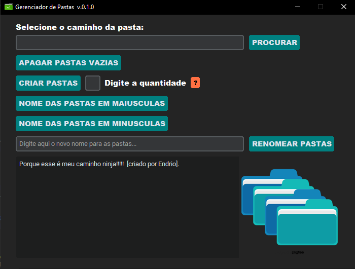

# 📁 Gerenciador de Pastas

<strong>Automatize operações em lote com pastas do Windows de forma rápida e prática.</strong>

  

---

# 📖 Sobre o Projeto

O **Gerenciador de Pastas** é uma aplicação desenvolvida em Python para automatizar operações repetitivas em diretórios do Windows.

Com apenas alguns cliques é possível executar diversas tarefas em lote, economizando tempo e evitando o trabalho manual de renomear ou criar dezenas de pastas individualmente.

Todo o processamento acontece localmente no computador, sem necessidade de conexão com a internet.

---

# ✨ Funcionalidades

✅ Excluir pastas vazias

✅ Criar várias pastas automaticamente

✅ Renomear pastas em lote

✅ Converter nomes para MAIÚSCULAS

✅ Converter nomes para minúsculas

✅ Interface simples e intuitiva

✅ Funcionamento totalmente offline

---

# 🖥️ Interface

---

# 📂 Estrutura do Projeto

GerenciadorDePastas/
│
├── GerenciadorDePastas.exe
├── assets/
├── demais arquivos...

> **Importante:** Todos os arquivos do projeto devem permanecer no mesmo diretório para garantir o funcionamento correto da aplicação.

---

# 🚀 Instalação (Windows)

## 1️⃣ Baixe o programa

Acesse a página de **Releases** deste repositório e baixe a versão mais recente do **GerenciadorDePastas.exe**.

---

## 2️⃣ Extraia os arquivos

Se o download estiver em formato **.rar**, extraia todo o conteúdo para uma pasta de sua preferência.

> **Importante:** Não mova apenas o arquivo `.exe`. Mantenha todos os arquivos extraídos na mesma pasta para garantir o funcionamento correto da aplicação.

---

## 3️⃣ Execute o programa

Dê um duplo clique em **GerenciadorDePastas.exe**.

Se o Windows exibir um aviso de segurança:

- Clique em **Mais informações**.
- Em seguida, clique em **Executar assim mesmo**.

Pronto!

O Gerenciador de Pastas será aberto e estará pronto para uso.

---

## 💡 Observação

Caso o Windows Defender ou outro antivírus apresente um alerta, isso pode acontecer porque o programa não possui assinatura digital. Se o arquivo foi baixado diretamente deste repositório, basta permitir a execução.

# 📝 Como utilizar

### 📂 Selecionar diretório

Clique em **PROCURAR** e escolha a pasta onde deseja realizar as operações.

---

### 🗑️ Excluir pastas vazias

Clique em **APAGAR PASTAS VAZIAS** para remover todos os diretórios sem conteúdo.

---

### 📁 Criar várias pastas

- Informe a quantidade desejada.
- Clique em **CRIAR PASTAS**.

O programa criará automaticamente as novas pastas.

---

### ✏️ Renomear pastas

Digite o novo nome base.

Clique em **RENOMEAR PASTAS**.

Todas as pastas serão renomeadas em sequência.

---

### 🔠 Converter para MAIÚSCULAS

Clique em **NOME DAS PASTAS EM MAIÚSCULAS**.

Todos os nomes serão convertidos automaticamente.

---

### 🔡 Converter para minúsculas

Clique em **NOME DAS PASTAS EM MINÚSCULAS**.

Todos os nomes serão convertidos automaticamente.

---

# ⚙️ Requisitos

- Windows 10 ou superior
- Nenhuma instalação adicional é necessária
---

# 💡 Vantagens

- 🚀 Automatiza tarefas repetitivas
- 📁 Gerenciamento em lote
- 💻 Interface gráfica intuitiva
- 🔒 Processamento totalmente local
- ⚡ Economia de tempo
- 🖱️ Fácil de utilizar

---

# 🛠️ Tecnologias Utilizadas

- Python
- Tkinter
- OS
- Shutil

---

# 📌 Observações

- Utilize sempre uma pasta de teste antes de executar operações importantes.
- O programa realiza alterações diretamente no sistema de arquivos.
- Certifique-se de possuir permissão para modificar os diretórios selecionados.
- Mantenha todos os arquivos do projeto no mesmo diretório.

---

# 📄 Licença

Este projeto é distribuído para fins de estudo e uso pessoal.

---

## ⭐ Gostou do projeto?

Se este projeto foi útil para você, deixe uma **⭐** no repositório!

Desenvolvido com ❤️ por **Endrio Santos**.

